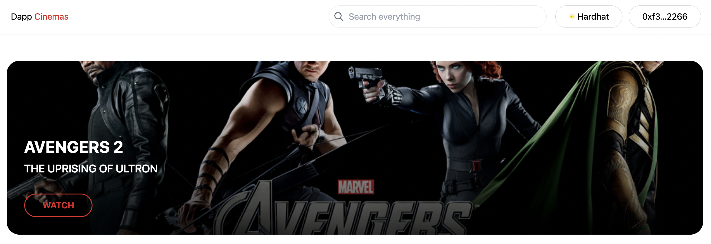
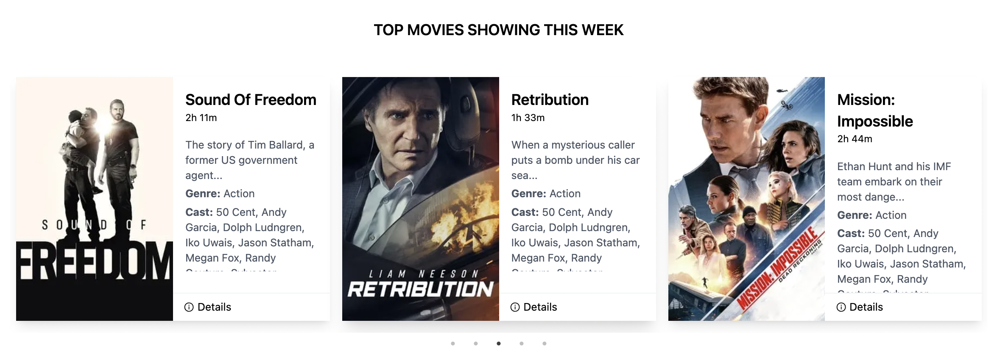
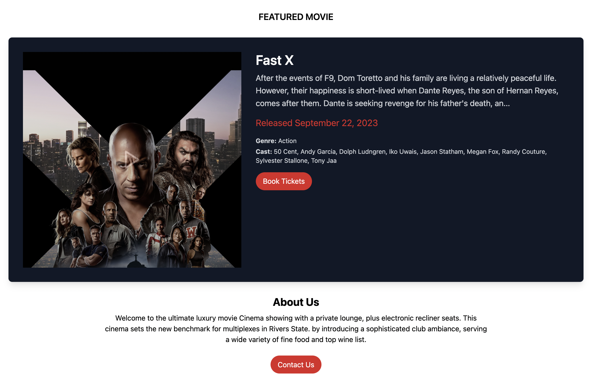
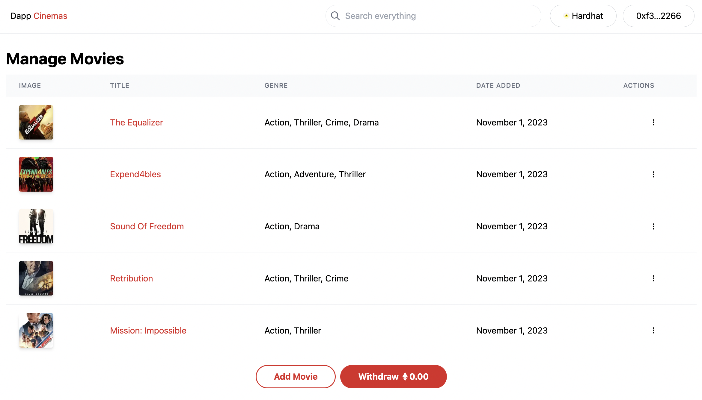
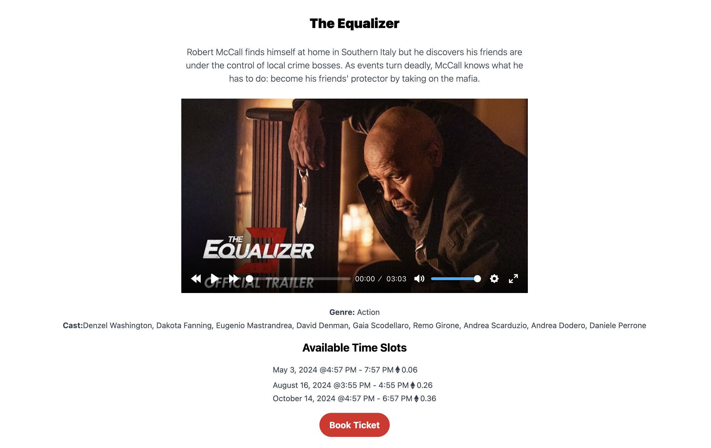

# Fullstack NFT Cinemas System

Fullstack NFT Cinemas System is a web3 application built with Next.js and Ethereum blockchain. It's designed to manage a cinema, providing features such as movie management, ticket booking, and more.

## Table of Contents

- [Features](#features)
- [Components](#components)
- [Setup](#setup)
- [Blockchain Integration](#blockchain-integration)
- [Store](#store)
- [Utils](#utils)
- [Smart Contracts](#smart-contracts)

## Features

- Movie Management
- Time Slot Management
- Ticket Booking System
- Ethereum Blockchain Integration

## Components

- Banner
- Booking Modal
- Connect Button
- Contact
- Movie Deletion
- Slot Deletion
- Movie Details
- Featured Movie
- Find Holders
- Finish Slots
- Footer
- Header
- Menu
- Movie Actions
- Movie Cards
- Movie Table
- Navigation Button
- Offers
- Theater Player
- Timeslot Actions
- Timeslot List
- Timeslot Table
- Withdrawal

## Setup

1. Clone the repository.
2. Install the dependencies using `npm install`.
3. Create a `.env` file and add the following keys:
   `NEXT_PUBLIC_RPC_URL=http://127.0.0.1:8545

    NEXT_PUBLIC_ALCHEMY_ID=<Replace_with_Alchemey_Project_ID>

    NEXT_PUBLIC_PROJECT_ID=<Replace_with_Wallet_Connect_Porject_ID>

    NEXT_PUBLIC_INFURIA_API_KEY=<Replace_with_an_infuria_bucket_API_Key>
    
    NEXT_PUBLIC_INFURIA_API_SECRET=<Replace_with_an_infuria_bucket_API_Secret>

    NEXTAUTH_URL=http://localhost:3000
    
    NEXTAUTH_SECRET=somereallysecretsecret
    `
4. Start hardhat server using `npx hardhat node`.
5. Deploy smart contract to network using `npx hardhat run scripts/deploy.js`.
6. Start the development server using `npm run dev`.
7. Open [http://localhost:3000](http://localhost:3000) with your browser to see the result.

## Blockchain Integration

The application uses Ethereum blockchain for backend operations. It interacts with two smart contracts: `cinemaContract` and `ticketContract`. The addresses of these contracts are stored in `contractAddress.json`.

## Store

The application uses Redux for state management. The `store` directory contains the actions and states for global management.

## Utils

The `utils` directory contains fake data, helper functions, and type definitions used across the application.

## Smart Contracts

The `contracts` directory contains the Solidity smart contracts that power the blockchain functionality of the Fullstack NFT Cinemas System.

### DappCinemas.sol

This is the main contract that handles the core functionalities of the cinema system.

### DappTickets.sol

This is the sub contract that handles the responsibility of managing tickets as NFTs.

### Base64.sol

This is a utility contract that provides a function for encoding some bytes in base64.

### DappShared.sol

This contract provides shared data and functions that are used in other contracts.

## License

MIT License

Copyright (c) 2023 Dapp Mentors

Permission is hereby granted, free of charge, to any person obtaining a copy
of this software and associated documentation files (the "Software"), to deal
in the Software without restriction, including without limitation the rights
to use, copy, modify, merge, publish, distribute, sublicense, and/or sell
copies of the Software, and to permit persons to whom the Software is
furnished to do so, subject to the following conditions:

The above copyright notice and this permission notice shall be included in all
copies or substantial portions of the Software.

THE SOFTWARE IS PROVIDED "AS IS", WITHOUT WARRANTY OF ANY KIND, EXPRESS OR
IMPLIED, INCLUDING BUT NOT LIMITED TO THE WARRANTIES OF MERCHANTABILITY,
FITNESS FOR A PARTICULAR PURPOSE AND NONINFRINGEMENT. IN NO EVENT SHALL THE
AUTHORS OR COPYRIGHT HOLDERS BE LIABLE FOR ANY CLAIM, DAMAGES OR OTHER
LIABILITY, WHETHER IN AN ACTION OF CONTRACT, TORT OR OTHERWISE, ARISING FROM,
OUT OF OR IN CONNECTION WITH THE SOFTWARE OR THE USE OR OTHER DEALINGS IN THE
SOFTWARE.

## Useful links

- 🏠 [Website](https://dappmentors.org/)
- ⚽ [Metamask](https://metamask.io/)
- 🚀 [Alchemy](https://alchemy.com/)
- 💡 [Hardhat](https://hardhat.org/)
- 📈 [Infuria](https://infura.io/)
- 🔥 [NextJs](https://nextjs.org/)
- 🎅 [TypeScript](https://www.typescriptlang.org/)
- 🐻 [Solidity](https://soliditylang.org/)
- 👀 [EthersJs](https://docs.ethers.io/v5/)
- ✨ [Wallet Connect](https://cloud.walletconnect.com/sign-in)
- 🚨 [Demo](https://dapp-cinemas-x.vercel.app/)
